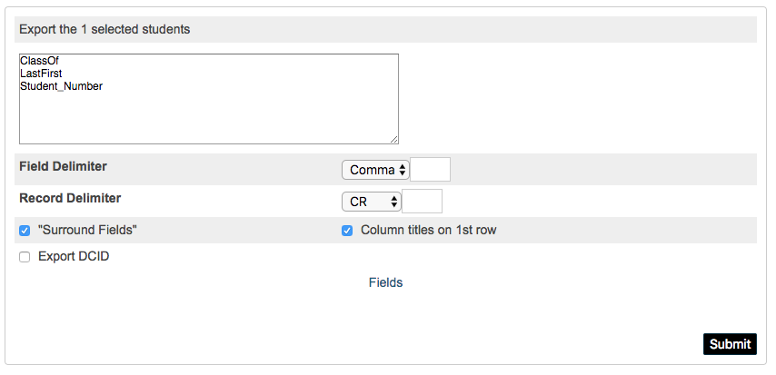

portfolioCreator
======
The portfolio creator script creates an empty set of folders for students on Google Team Drive using the [Google Drive REST API V3](https://developers.google.com/drive/api/v3/reference/) using OAuth authentication via a local web browser.

The project depends on credentials (client_secrets.json) file tied to a particular google drive account. Should the included client_secrets.json stop working, a new secret can be generated using the instructions below from any Google Suite (formerly Google Apps for Education) account.

Building
--------
### Requirements
Required python modules for building a single package distribution 
- python 2.7.x
- pyinstaller>=3.2.4
- humanfriendly==4.16.1
- httplib2==0.10.3
- google_api_python_client==1.7.4
- progressbar2==3.38.

### Setting up environment for building from source
#### Installing with Homebrew & pip
* Download and install [HomeBrew](https://brew.sh/) as an admin user
* As an administrator (but not with sudo) setup pip & virtenv
    - `$ brew install python`
    - `$ pip install -U pip`
    - `$ pip install virtualenv`
    - `$ pip install virtualenvwrapper`
    - Allow pip to only work in a virtual env: `$ echo export PIP_REQUIRE_VIRTUALENV=true > ~/.bash_profile`
 #### Create a virtual environment
 * `$ mkvirtualenv python2.7`
 * ` pip install pyinstaller humanfriendly httplib2 google_api_python_client progressbar`

### Preparing to Build
Make sure a valid and functioning client_secrets.json file is available in the ./resrources directory
[Complete Instructions for OAuth2 Installed Applications](https://developers.google.com/identity/protocols/OAuth2InstalledApp) file
#### Generate a client_secrets.json
* Visit [Google API Console](https://console.developers.google.com/projectcreate)
    - Give the project a name `Portfolio Creator` and click "Create"
* Enable the Google Drive API in the [API Library](https://console.developers.google.com/apis/library)
    - Ensure the project created above is selected 
    - Search for "Google Drive" and "Enable"
    - "Create Credentials" - see following step
* From the [API Console Credentials Menu](https://console.developers.google.com/apis/credentials) select the project you created above. Click **Create credeitials** > Help me choose
    1. **Add Credentials:** 
        - *Which API are you using?* Drive API credentials
        - *Where Will you be calling the API from?* Other UI(e.g. Windows, CLI tool)
        - *What data will you be accessing?* User Data
    2. **Create OAuth client ID**
        - *Name* Portfolio Creator CLI YYYY-MM-DD
        - Click *Create OAuth client ID*
    3. **Setup OAuth 2.0 consent screen**
        - *Email address* Use the default
        - *Product name shown to users* Portfolio Creator
        - *More Opations*
            . *Homepage URL* https://ash.nl
        - Continue
    4. **Download credentials**
        - *Download*
        - Locate downloaded file and rename `client_secrets.json` and move into the ./resources/ folder
    
To build a single-file version of the application that can be run from  the command line or from OS X Finder use:
```
$ pyinstaller --clean portfolioCreator.spec
```

Specifications
--------------
The script creates portfolio folders using in the following format on a google Team Drive in the following format from Preschool through Grade 12 (inclusive):
```
[Google Team Drive]
    Portfolio Folder
    │
    └───Class Of-2001
        |
        └───Lastname, Firstname - 000000
             |
             └───00-Preschool
             |
             └───00-Transition Kindergarten
             |
             └───00-zKindergarten  #z forces the sort to work properly
             |
             └───01-Grade
             |
             └───02-Grade
             |
             └───03-Grade
             |
             └───12-Grade
```
Student folder names are based on the LastFirst field from PowrSchool and the student_number field. Student folders are generated as: Lastname, Firstname - 000000. See the samples below:
* Mercury, Freddy - 519460
* Avogadro, Amedeo - 602210
* Montoya, Inigo - 123456

The namming of the grade-level folders is controlled by ./resources/gradefolders.txt. An alternative format can be specified in the configuration file (see configuration section).
The gradefolders.txt file must have one single folder title per line. Trailing whitespace will be stripped
```
00-Preschool
00-Transition Kindergarten
00-zKindergarten
01-Grade
02-Grade
03-Grade
04-Grade
05-Grade
06-Grade
07-Grade
08-Grade
09-Grade
10-Grade
11-Grade
12-Grade
```
Configuration
-------------
The first time the program is run (or if the configuration file is missing) it will attempt to configure its self. During the OAuth authentication flow, the user will be asked to approve the application. It is important that the user that has access to the Team Drive folder that will contain the portfolio folders. 

Configuration is maintained by ~/.config/portfolioCreator/portfolioCreator.ini using the typical 'ini' format. The configuration will be generated the first time the application is run.
The configuration can (and should) be updated during the execution of the program, but can also be managed here
```
[Main] # main section - this MUST be included
# path to credentials created through the OAuth 2.0 process
credentials = ~/.config/portfolio_creator/credentials/ 

# Team Drive: human readable name
teamdrivename = IT Blabla 
# Team Drive: resource ID - Provided for reference, it does NOT control the folder used
teamdriveid = 0ACLfU8KeD_BHUk9PVA
# Team Drive: folder name - Provided for reference, it does NOT control the folder used
foldername = Port Wine 
# Team Drive: folder ID
folderid = 1-D7UNBes_skfkQ6oBettiBICiBcZmbvn 

# authenicated user - Provided for reference, it does NOT control the authenticated user
useremail = aciuffo@ash.nl 

# Log level DEBUG, INFO, WARN, ERROR, CRITICAL
loglevel = ERROR 

# Optional Alternative gradefolders.txt
gradefolders = /path/to/alternative/gradefolders.txt
```
Use
---
### Prepare Student.Export.text file
Locate any new students in PowerSchool and run a quick export. Save the student.export.text file into either the Downloads or Desktop folder. 
#### Quick Export Required Fields (additional fields are ignored):
```
LastFirst
Student_Number
ClassOf
```
#### Quick Export Settings
* Field Delimiter: `Comma`
* Record Delimiter `CR`
* ☑ "Surround Fields"
* ☑ Column titles on 1st row

#### Quick Export Sample Settings


### Execute Program
Run the portfolioCreator program created in the ./dist folder by pyinstaller. The program can be called from the commandline `$ ./portfolioCreator`. It can also be run by double clicking on the file in the OS X Finder.

Once the program completes execution, a CSV is prepared and written to the user's desktop. This file should be shared with the powerschool administrator. The CSV contains a link to each student's Portfolio folder on Google Team Drive

### Adding HTML to PowerSchool
See BA for instructions

Resolving Issues
----------------
The program attempts to recover from most errors and continue creating folders. Should it encounter a problem creating student folders, the student will be skipped and the user is notified. In this case, the student.export.text can be run again. Only missing folders are created. The program will not create duplicate folders on Team Drive.

Should the program encounter an irrecoverable error and crashes, the student.export.text file can be run again without consequence. Should this problem persist, change the loglevel to DEBUG either through the configuration file (see above), or change the loglevel during the runtime configuration.

Logs are recorded in ~/portfolioCreator_errors.log and are very helpful for debugging problems.
